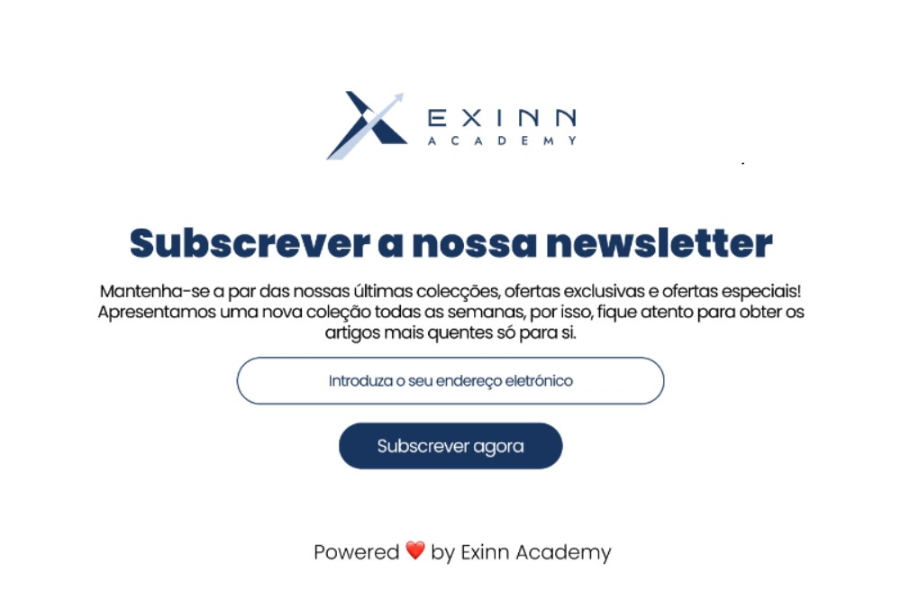

# 📰 News Letter

Este projeto faz parte de um dos desafios propostos na **mentoria da Dev Experience**. O objetivo é simular uma página de inscrição em uma newsletter, com foco em design intuitivo, boas práticas de front-end e usabilidade.

## 📌 Objetivos do projeto

- Criar uma interface simples e eficaz para inscrição em uma newsletter.
- Utilizar HTML e CSS de forma limpa e estruturada.

## 🚀 Tecnologias utilizadas

- HTML5
- CSS3

## 💡 Aprendizados

Este projeto ajudou a reforçar conhecimentos sobre:
- Estrutura semântica com HTML.
- Estilização moderna com CSS.

## 📷 Captura de Tela

Você pode adicionar aqui uma imagem da interface:
